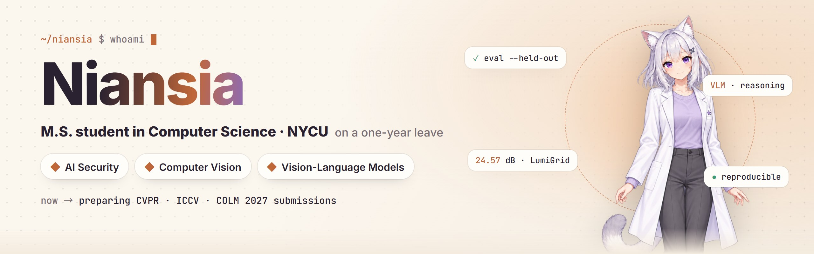

<picture>
  <source media="(prefers-color-scheme: dark)" srcset="assets/readme/cover-en-dark.jpg">
  
</picture>

[繁體中文](https://github.com/niansia/niansia/blob/main/README.zh-TW.md) · [简体中文](https://github.com/niansia/niansia/blob/main/README.zh-CN.md) · **English**

   

Researching the security, robustness and reasoning of visual and multimodal AI, and turning research questions into tools whose evidence can be checked and reproduced.

## About

I studied Computer Science at **Yuan Ze University (YZU)** and am an M.S. student in Computer Science at **National Yang Ming Chiao Tung University (NYCU)**, currently on a one-year leave. I work where **AI security, computer vision and vision-language models** meet, with a focus on reliable multimodal reasoning and evaluation.

I like to turn research questions and practical needs into reproducible tools: each claim should come with the evidence to check it.

## Now

- ✍️ Preparing submissions to **CVPR 2027** (VLM-related), **ICCV 2027** (DiT-related) and **COLM 2027**.
- 🚀 **[Taiwan Exam](https://github.com/niansia/taiwan-exam)**, an Agent Skill for original GSAT practice exams, public since 28 September 2026.
- 🌙 Built **[LumiGrid](https://github.com/niansia/LumiGrid)** for NTIRE 2025 low-light enhancement: +8.1 dB over the course pipeline it started from.
- 🎓 On a one-year leave from the NYCU master's program.

## Research interests

<table width="100%">
<tr>
<td width="50%" valign="top">

### 🛡️ AI & multimodal security

- Security and robustness of multimodal AI
- Adversarial and failure-mode analysis
- Content integrity and verification
- Trustworthy, auditable evaluation

</td>
<td width="50%" valign="top">

### 👁️ Vision & multimodal intelligence

- Computer vision and vision-language models
- Multimodal reasoning and memory
- Evaluation under real-world uncertainty
- Reproducible failure analysis

</td>
</tr>
</table>

## Featured projects

<table width="100%">
<tr>
<td width="50%" valign="top">

**[Taiwan Exam](https://github.com/niansia/taiwan-exam)** &nbsp;<code>Agent Skill</code> <code>GSAT · 7 subjects</code>

Has an AI write an original GSAT practice exam, re-solve every item without the answer, and stamp it onto the original exam templates as a question PDF and a worked-solution PDF.
</td>
<td width="50%" valign="top">

**[LumiGrid](https://github.com/niansia/LumiGrid)** &nbsp;<code>Computer vision</code> <code>NTIRE 2025</code>

Low-light enhancement with a luminance-guided bilateral grid of Zero-DCE curves and a NAFNet refiner. 24.57 dB / 0.840 SSIM on 20 held-out NTIRE 2025 pairs, trained on one laptop GPU.
</td>
</tr>
<tr>
<td width="50%" valign="top">

**[KCrashLab](https://github.com/niansia/KCrashLab)** &nbsp;<code>Systems reliability</code> <code>Evidence freeze</code>

A simulation-first platform for deterministic, reproducible Windows driver reliability experiments: canonical cases, resumable campaigns, exact failure signatures and independently verifiable evidence.
</td>
<td width="50%" valign="top">

**[Adversarial Lab](https://github.com/niansia/adversarial-lab)** &nbsp;<code>AI security</code> <code>Live demo</code>

FGSM and PGD attacks on a digit classifier, running on your CPU in the browser, against an adversarially trained model that keeps 85% accuracy at ε = 0.3 where the standard one drops to 0%; with decision maps and gradient-masking checks.
</td>
</tr>
<tr>
<td width="50%" valign="top">

**[ChromaRecover](https://github.com/niansia/ChromaRecover)** &nbsp;<code>Computer vision</code> <code>Public alpha</code>

A local-first toolkit that recovers spatial structure carried by subtle colour differences, tests competing hypotheses, keeps auditable artifacts and abstains when evidence is weak.
</td>
<td width="50%" valign="top">

**[NoveltyAudit](https://github.com/niansia/NoveltyAudit)** &nbsp;<code>Scholarly reasoning</code> <code>Alpha</code>

An evidence-first Agent Skill for adversarial novelty audits: it freezes claims before retrieval, finds Minimal Prior Sets, applies historical cutoffs and records what the search could not establish.
</td>
</tr>
</table>

<a href="https://niansia.com/work/">All projects and interactive demos →</a>

## Tools

## Contact

I welcome thoughtful conversations about AI security, CV / VLM reasoning, trustworthy machine learning, reproducibility and research tooling, whether that is reading papers together, reproducing a result, designing a benchmark or turning a rough idea into a prototype that can be checked.

📮 **[niansia930202@gmail.com](mailto:niansia930202@gmail.com)**

