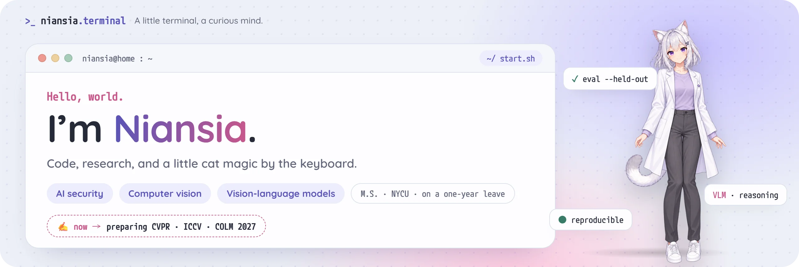
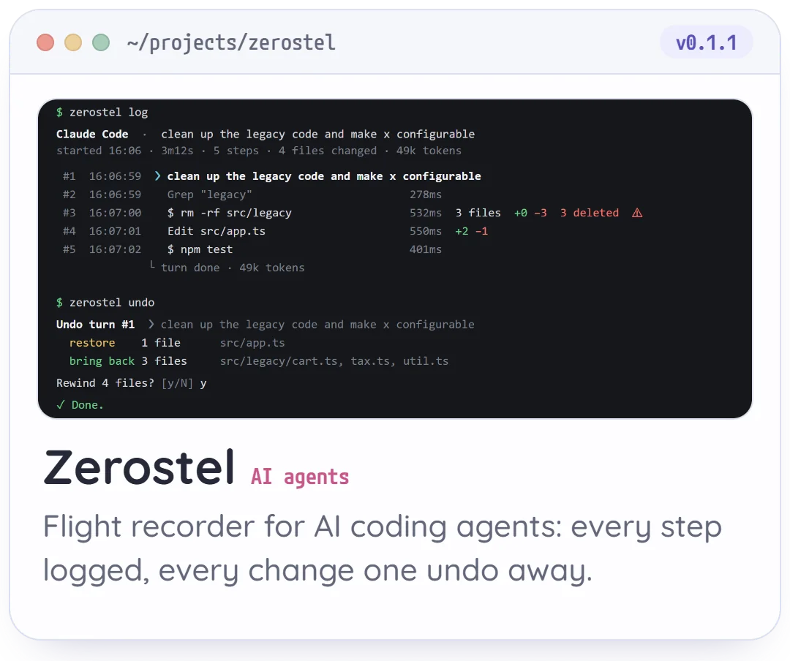
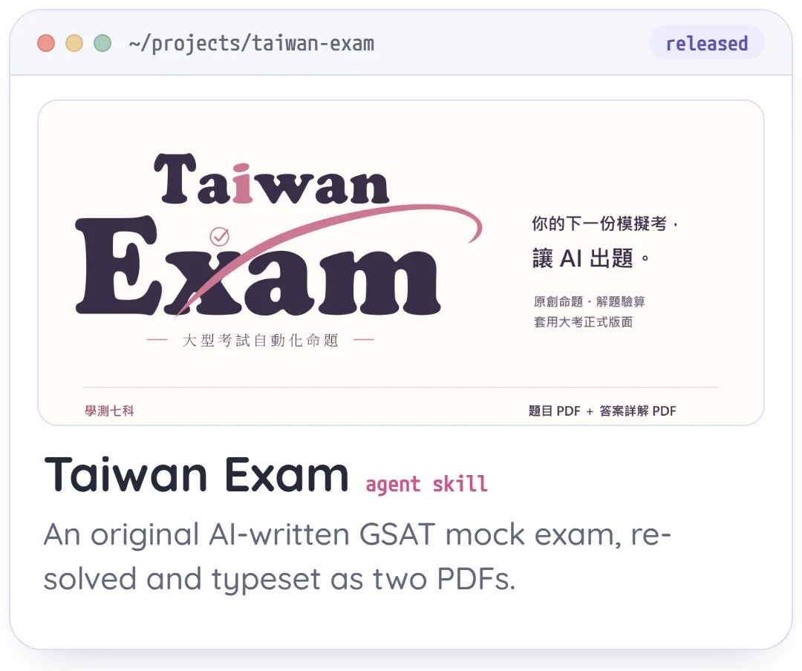
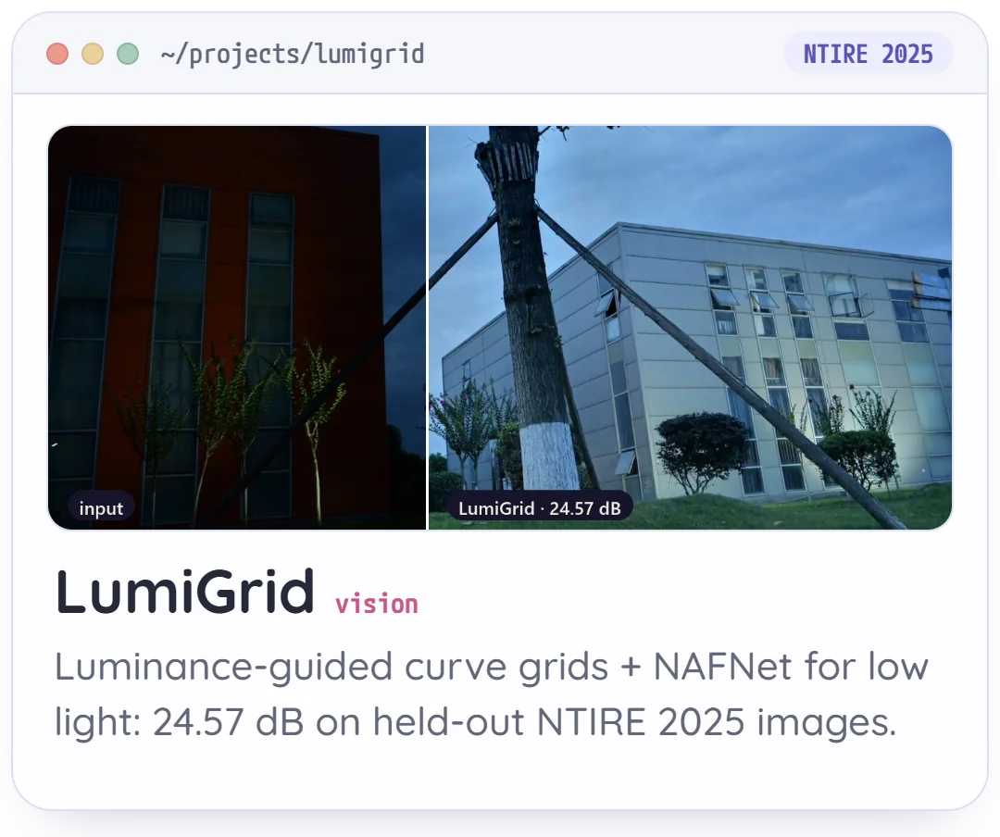
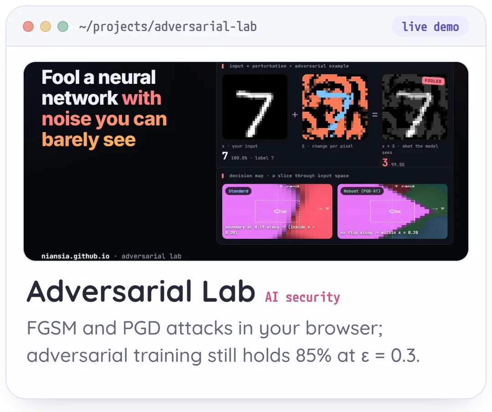
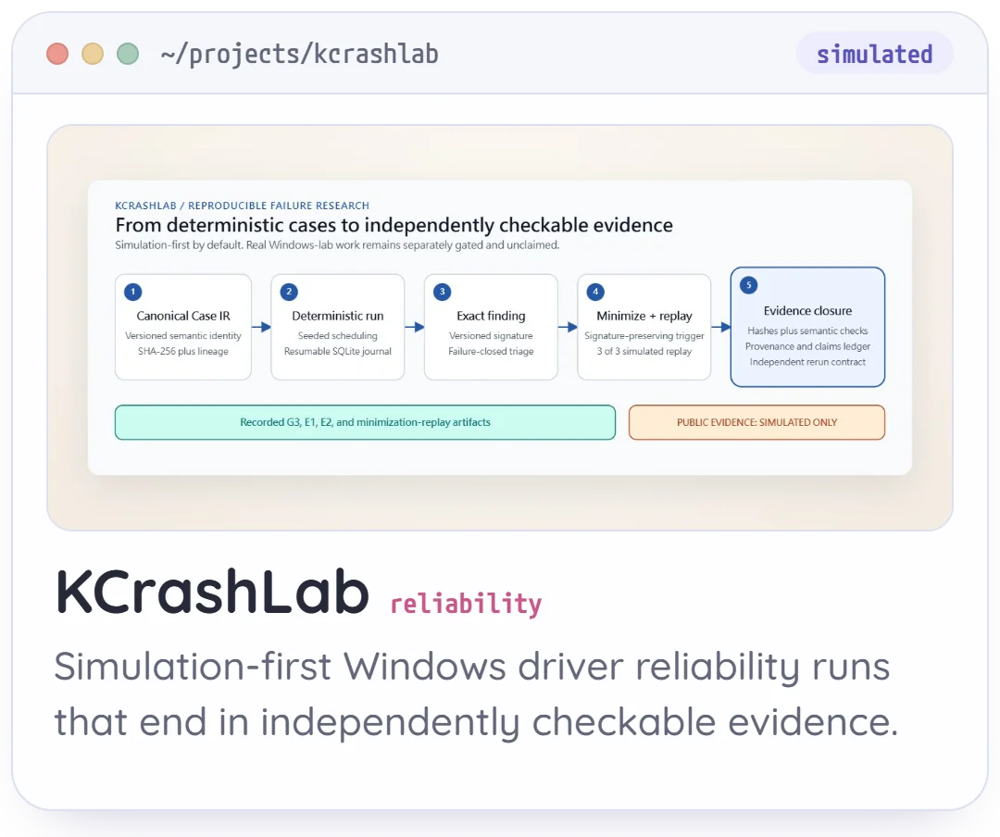
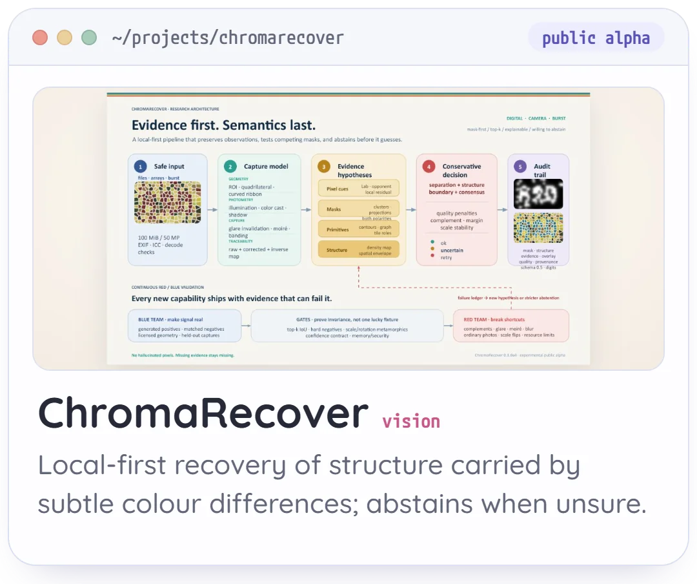

<picture><source media="(prefers-color-scheme: dark)" srcset="assets/readme/hero-en-dark.webp"></picture>

<a href="https://niansia.com/"><b>niansia.com</b></a> &nbsp;·&nbsp; <a href="https://niansia.com/work/">Projects</a> &nbsp;·&nbsp; <a href="https://niansia.com/#research">Research</a> &nbsp;·&nbsp; <a href="https://niansia.com/blog/en/">Blog</a> &nbsp;·&nbsp; <a href="mailto:niansia930202@gmail.com">Email</a>

[繁體中文](https://github.com/niansia/niansia/blob/main/README.zh-TW.md) · [简体中文](https://github.com/niansia/niansia/blob/main/README.zh-CN.md) · **English**

## About

I studied Computer Science at **Yuan Ze University** and am an M.S. student in Computer Science at **NYCU**, on a one-year leave. I work where **AI security, computer vision and vision-language models** meet, and I like turning research questions into reproducible tools: every claim should come with the evidence to check it.

- 🛡️ **AI & multimodal security** · robustness of multimodal AI · adversarial and failure-mode analysis · content integrity · auditable evaluation
- 👁️ **Vision & multimodal intelligence** · computer vision and VLMs · multimodal reasoning and memory · evaluation under real-world uncertainty · reproducible failure analysis

## Now

- ✍️ Preparing submissions to CVPR, ICCV and COLM 2027.
- ⏪ **[Zerostel](https://github.com/zerostel/zerostel)**, a flight recorder and time machine for AI coding agents, public since 5 October 2026.
- 🚀 **[Taiwan Exam](https://github.com/niansia/taiwan-exam)**, an Agent Skill for original GSAT practice exams, public since 28 September 2026.
- 🌙 Built **[LumiGrid](https://github.com/niansia/LumiGrid)** for NTIRE 2025 low-light enhancement: +8.1 dB over the course pipeline it started from.
- 🐾 Running **[niansia.com](https://niansia.com/)**, a terminal-style portfolio where Yuki, a cat-eared guide, answers questions with an in-browser model.

## Featured projects

<a href="https://github.com/zerostel/zerostel"><picture><source media="(prefers-color-scheme: dark)" srcset="assets/readme/tiles/zerostel-en-dark.webp"></picture></a>
<a href="https://github.com/niansia/taiwan-exam"><picture><source media="(prefers-color-scheme: dark)" srcset="assets/readme/tiles/taiwan-exam-en-dark.webp"></picture></a>
<a href="https://github.com/niansia/LumiGrid"><picture><source media="(prefers-color-scheme: dark)" srcset="assets/readme/tiles/lumigrid-en-dark.webp"></picture></a>
 
<a href="https://github.com/niansia/adversarial-lab"><picture><source media="(prefers-color-scheme: dark)" srcset="assets/readme/tiles/adversarial-lab-en-dark.webp"></picture></a>
<a href="https://github.com/niansia/KCrashLab"><picture><source media="(prefers-color-scheme: dark)" srcset="assets/readme/tiles/kcrashlab-en-dark.webp"></picture></a>
<a href="https://github.com/niansia/ChromaRecover"><picture><source media="(prefers-color-scheme: dark)" srcset="assets/readme/tiles/chromarecover-en-dark.webp"></picture></a>

<a href="https://niansia.com/work/">All 12 projects and live demos →</a>

## Tools & activity

<picture><source media="(prefers-color-scheme: dark)" srcset="https://raw.githubusercontent.com/niansia/niansia/output/yuki-eats-contributions-dark.svg"></picture>

## Let's research together

If you work on **AI security, CV / VLM reasoning, trustworthy ML, reproducibility or research tooling**, I'd love to hear from you: reading papers together, reproducing a result, designing a benchmark, or turning a rough idea into a prototype that can be checked.

📮 **[niansia930202@gmail.com](mailto:niansia930202@gmail.com)** &nbsp;·&nbsp; I read every mail, even when I can't reply right away. `(=^･ω･^=)`

<picture><source media="(prefers-color-scheme: dark)" srcset="assets/readme/contact-terminal-dark.svg"></picture>

