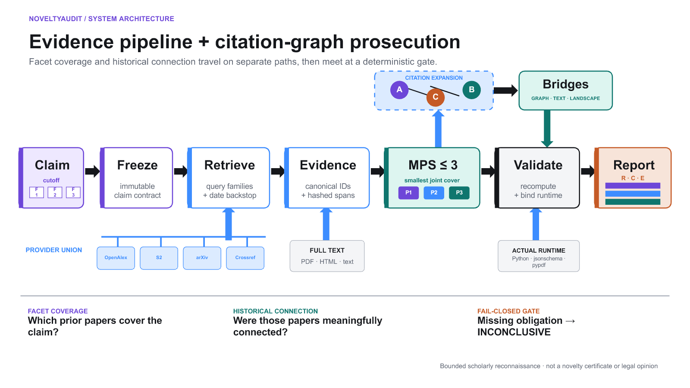
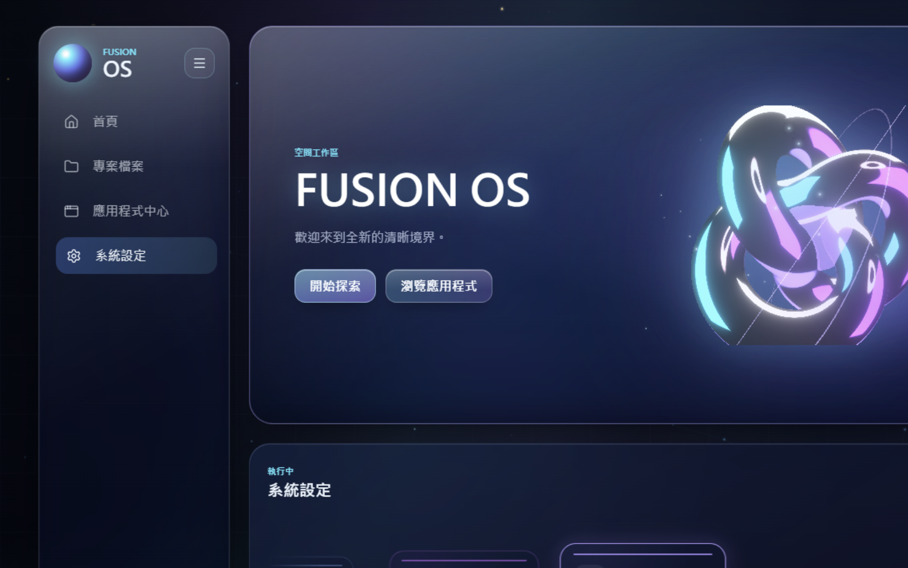

# 嗨，我是 niansia 👋

[繁體中文](https://github.com/niansia/niansia/blob/main/README.zh-TW.md) · **简体中文** · [English](https://github.com/niansia/niansia/blob/main/README.md)

### 元智大学计算机科学专业

**AI 安全 × 计算机视觉 × 视觉语言模型**

研究视觉与多模态智能系统的安全性、鲁棒性与推理能力。

**目前正在申请计算机科学相关研究生项目。**

[个人网站](https://niansia.github.io/zh-cn/) · [研究方向](https://niansia.github.io/zh-cn/#research) · [精选作品](https://niansia.github.io/zh-cn/#work) · [Email](mailto:wilbur930202@gmail.com)

## 关于我

我今年刚从**元智大学（YZU）计算机科学专业**毕业，主要关注 **AI 安全、计算机视觉与视觉语言模型**的交叉领域，尤其是可靠的多模态推理与模型评估。

我喜欢把研究问题转化为可复现的实验与可运行的系统，从证据导向的研究工具、模型评估流程，到交互式软件。目前部分研究仍在开发或评审阶段，因此保持非公开；代码、结果与可复现成果将在合适的时间发布。

## 研究兴趣

<table>
<tr>
<td width="50%" valign="top">

### 🛡️ AI 与多模态安全

- 多模态 AI 的安全性与鲁棒性
- 对抗攻击与失效模式分析
- 内容完整性与验证
- 可信赖、可审计的评估

</td>
<td width="50%" valign="top">

### 👁️ 视觉与多模态智能

- 计算机视觉与视觉语言模型
- 多模态推理与记忆
- 真实世界不确定性下的评估
- 可复现的失败案例分析

</td>
</tr>
</table>

## 精选项目

<table>
<tr>
<td width="50%" align="center" valign="top">
 
<strong><a href="https://github.com/niansia/NoveltyAudit">NoveltyAudit</a></strong> 
用于对抗式学术新颖性审计的证据导向工具，包含研究主张拆解、历史时间截点与 bridge-aware 既有工作分析。
</td>
<td width="50%" align="center" valign="top">
 
<strong><a href="https://github.com/niansia/fusion-os">Fusion OS</a></strong> 
以 C# / WebView2 外壳搭配 React + TypeScript 界面，整合 25 个以上交互应用的桌面型环境。
</td>
</tr>
</table>

## 更多项目

| 项目 | 实现内容 | 重点 |
| --- | --- | --- |
| **[研究会议教练](https://github.com/niansia/research-meeting-coach)** | 仍处于早期 alpha 阶段、以证据为核心的 Agent Skill，可将零散研究进展整理为导师能够快速决策的会议摘要，同时标示缺乏证据支持的主张与尚未完成的要求。 | 研究工作流程、证据完整性、AI Agent |
| **[花莲互助平台](https://github.com/niansia/fuxing)** | 支持灾情需求、志愿者协调与资源数据持久化的全栈原型。 | React、Node.js、SQLite、公益科技 |
| **[房贷决策支持](https://github.com/niansia/mortgage-decision-support)** | 结合蒙特卡洛压力测试、情景比较与风险指标的财务决策工具。 | 量化建模、模拟、C# |

## 延伸兴趣

`量化机器学习` · `系统` · `交互计算` · `研究软件`

## 使用工具

`Python` · `PyTorch` · `OpenCV` · `scikit-learn` · `Jupyter` · `C# / .NET` · `React` · `TypeScript` · `Node.js` · `SQLite` · `Git`

## 联系与合作

如果你也在研究 AI 安全、CV／VLM 推理、可信赖机器学习、实验复现或研究工具，欢迎发邮件交流想法、数据集与失败案例喵

联系邮箱是 **[wilbur930202@gmail.com](mailto:wilbur930202@gmail.com)**，期待一起把问题想清楚、把实验做扎实喵
