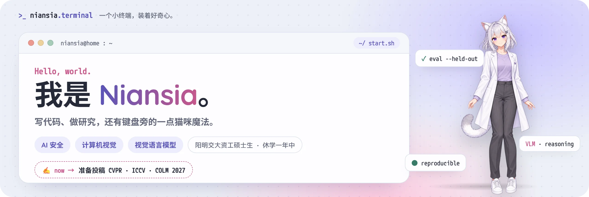
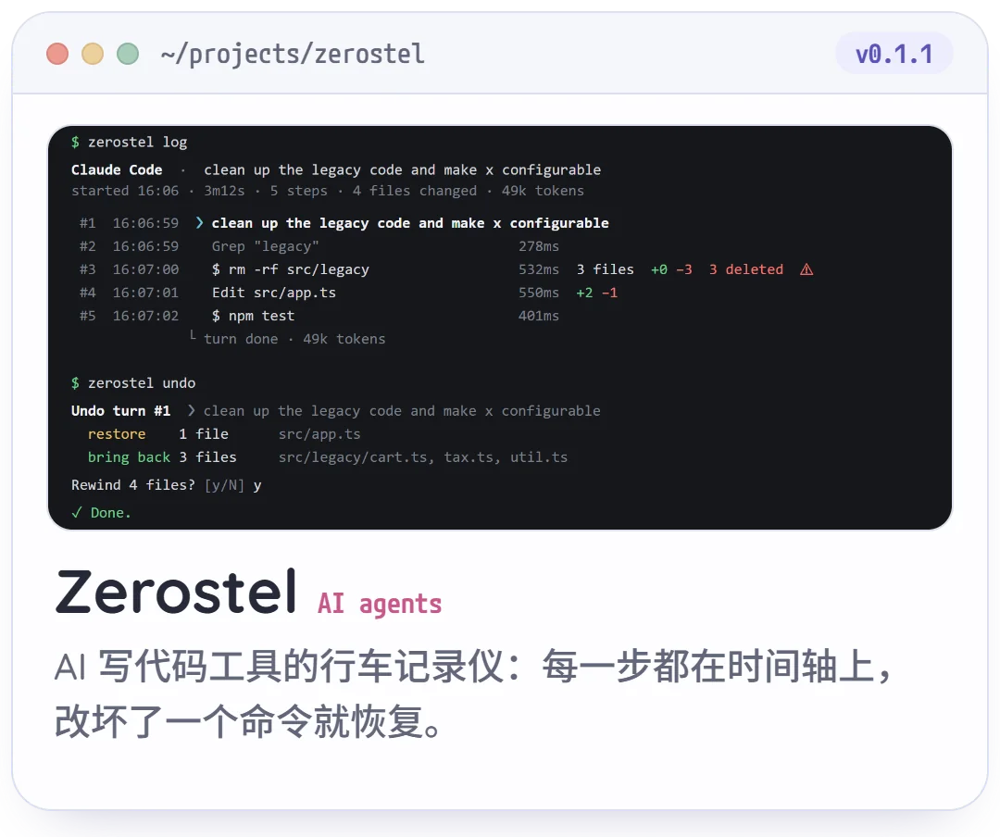
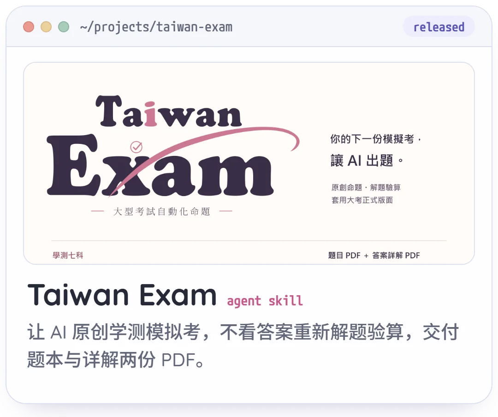
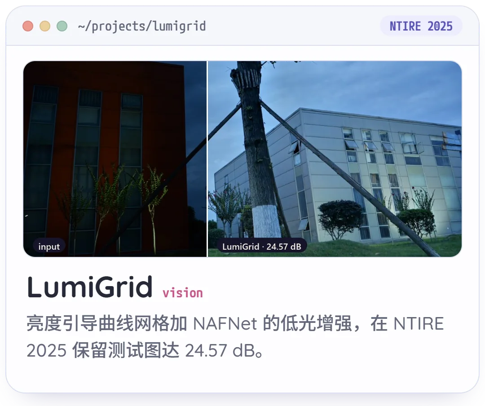
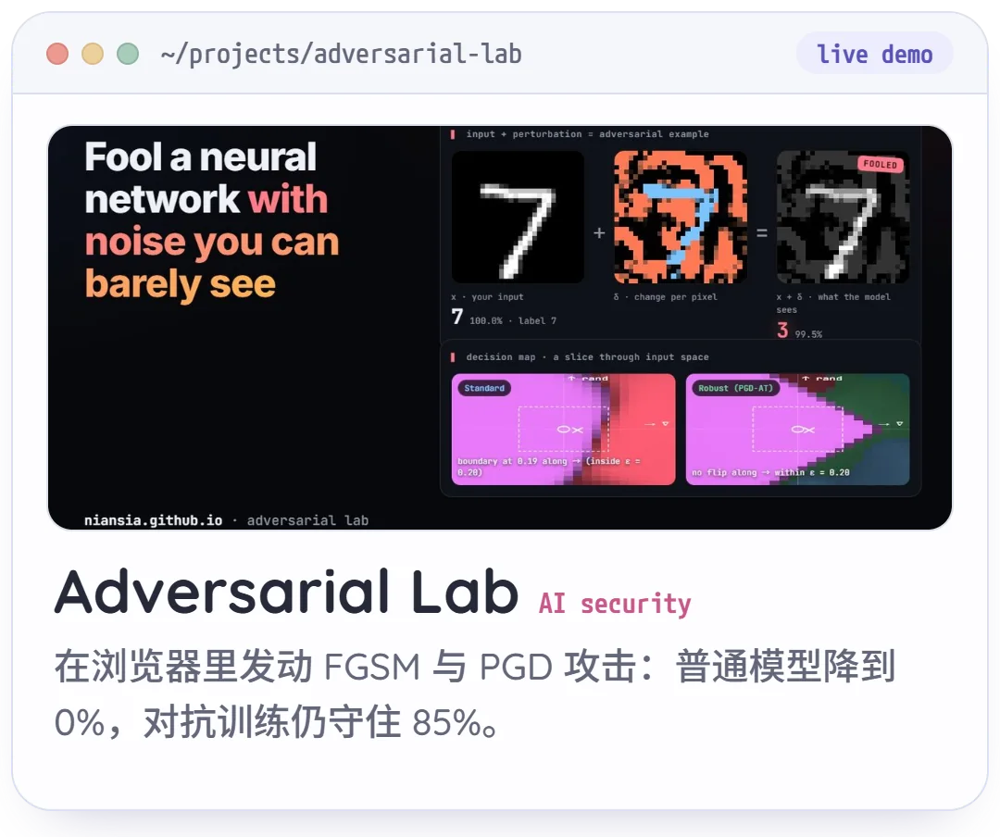
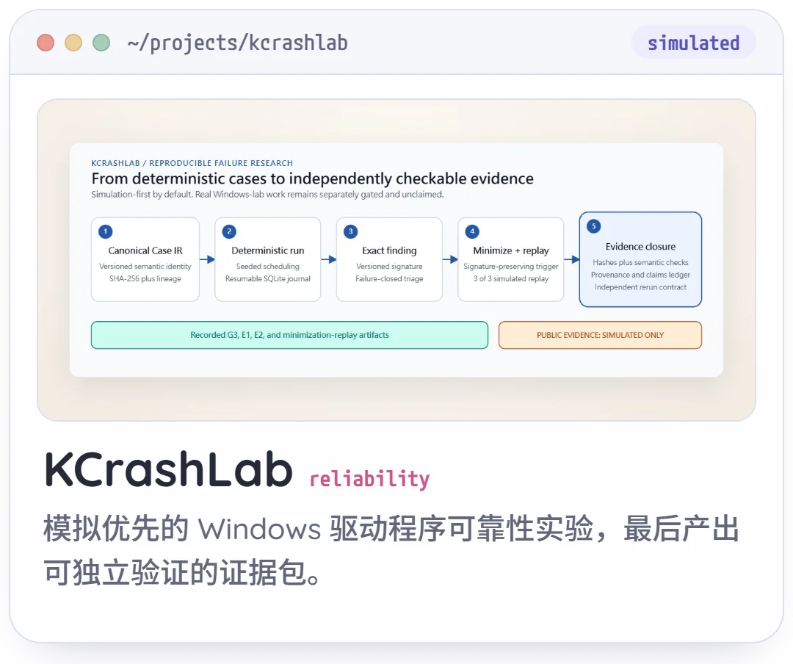
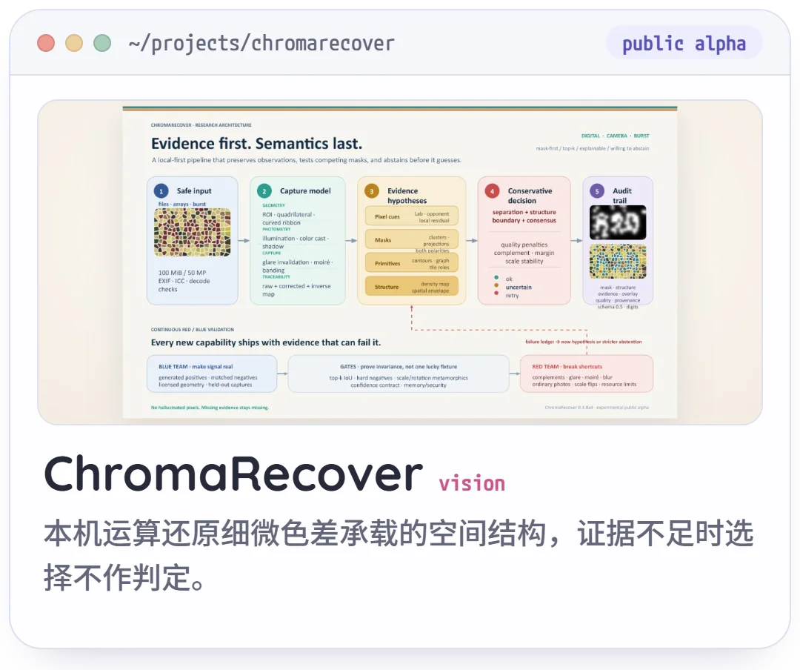

<picture><source media="(prefers-color-scheme: dark)" srcset="assets/readme/hero-zh-CN-dark.webp"></picture>

<a href="https://niansia.com/zh-cn/"><b>niansia.com</b></a> &nbsp;·&nbsp; <a href="https://niansia.com/zh-cn/work/">作品集</a> &nbsp;·&nbsp; <a href="https://niansia.com/zh-cn/#research">研究</a> &nbsp;·&nbsp; <a href="https://niansia.com/blog/zh-cn/">博客</a> &nbsp;·&nbsp; <a href="mailto:niansia930202@gmail.com">Email</a>

[繁體中文](https://github.com/niansia/niansia/blob/main/README.zh-TW.md) · **简体中文** · [English](https://github.com/niansia/niansia/blob/main/README.md)

## 关于我

我毕业于**元智大学资讯工程学系**，现在是**阳明交通大学资讯工程硕士生**，休学一年中。研究落在 **AI 安全、计算机视觉与视觉语言模型**的交汇处，也喜欢把研究问题做成可复现的工具：每一个结论，都应该附上能检查它的证据。

- 🛡️ **AI 与多模态安全** · 多模态 AI 的安全性与鲁棒性 · 对抗攻击与失效模式分析 · 内容完整性与验证 · 可信赖、可审计的评估
- 👁️ **视觉与多模态智能** · 计算机视觉与视觉语言模型 · 多模态推理与记忆 · 真实世界不确定性下的评估 · 可复现的失败案例分析

## 最近在做

- ✍️ 准备投稿 CVPR、ICCV 与 COLM 2027。
- ⏪ 2026 年 10 月 5 日公开 **[Zerostel](https://github.com/zerostel/zerostel)**：AI 写代码工具的行车记录仪和时光机。
- 🚀 2026 年 9 月 28 日公开 **[Taiwan Exam](https://github.com/niansia/taiwan-exam)**：让 AI 出原创学测模拟考的 Agent Skill。
- 🌙 完成 **[LumiGrid](https://github.com/niansia/LumiGrid)**（NTIRE 2025 低光图像增强），比出发点的课堂做法高 8.1 dB。
- 🐾 经营 **[niansia.com](https://niansia.com/zh-cn/)**：终端风格的作品集，猫耳助理 Yuki 用浏览器里的模型回答问题。

## 精选项目

<a href="https://github.com/zerostel/zerostel"><picture><source media="(prefers-color-scheme: dark)" srcset="assets/readme/tiles/zerostel-zh-CN-dark.webp"></picture></a>
<a href="https://github.com/niansia/taiwan-exam"><picture><source media="(prefers-color-scheme: dark)" srcset="assets/readme/tiles/taiwan-exam-zh-CN-dark.webp"></picture></a>
<a href="https://github.com/niansia/LumiGrid"><picture><source media="(prefers-color-scheme: dark)" srcset="assets/readme/tiles/lumigrid-zh-CN-dark.webp"></picture></a>
 
<a href="https://github.com/niansia/adversarial-lab"><picture><source media="(prefers-color-scheme: dark)" srcset="assets/readme/tiles/adversarial-lab-zh-CN-dark.webp"></picture></a>
<a href="https://github.com/niansia/KCrashLab"><picture><source media="(prefers-color-scheme: dark)" srcset="assets/readme/tiles/kcrashlab-zh-CN-dark.webp"></picture></a>
<a href="https://github.com/niansia/ChromaRecover"><picture><source media="(prefers-color-scheme: dark)" srcset="assets/readme/tiles/chromarecover-zh-CN-dark.webp"></picture></a>

<a href="https://niansia.com/zh-cn/work/">全部 12 个作品与互动展示 →</a>

## 工具与足迹

<picture><source media="(prefers-color-scheme: dark)" srcset="https://raw.githubusercontent.com/niansia/niansia/output/yuki-eats-contributions-dark.svg"></picture>

## 联系与合作

如果你也在做 **AI 安全、CV／VLM 推理、可信赖机器学习、实验复现或研究工具**，欢迎来找我聊聊喵：一起读 paper、复现实验、设计 benchmark，或把模糊的想法慢慢做成可以验证的 prototype，我都很乐意参与。

📮 **[niansia930202@gmail.com](mailto:niansia930202@gmail.com)** &nbsp;·&nbsp; 可能没办法每次都马上回复，但每封邮件都会认真读喵 `(=^･ω･^=)`

<picture><source media="(prefers-color-scheme: dark)" srcset="assets/readme/contact-terminal-dark.svg"></picture>

