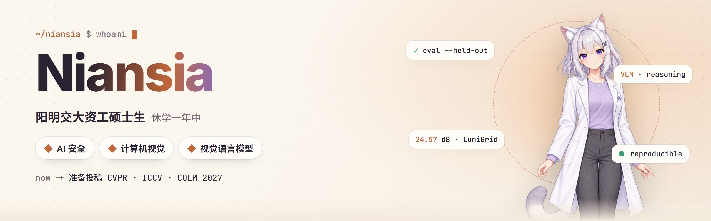
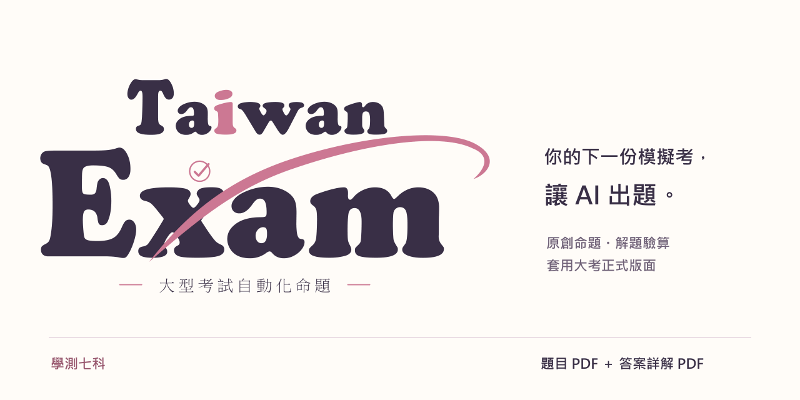
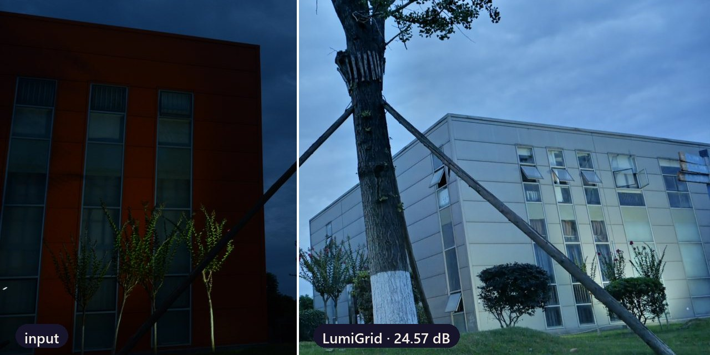
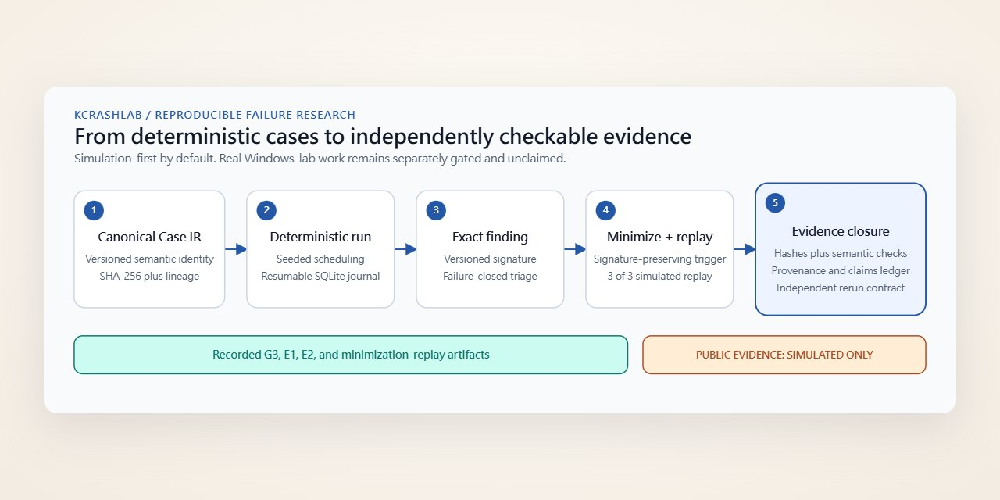
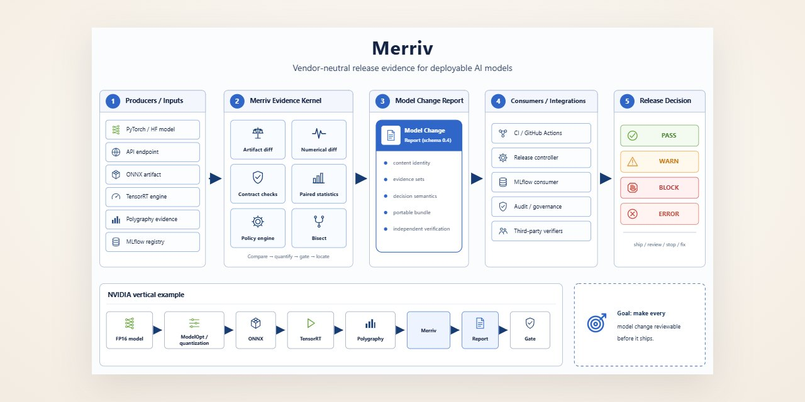
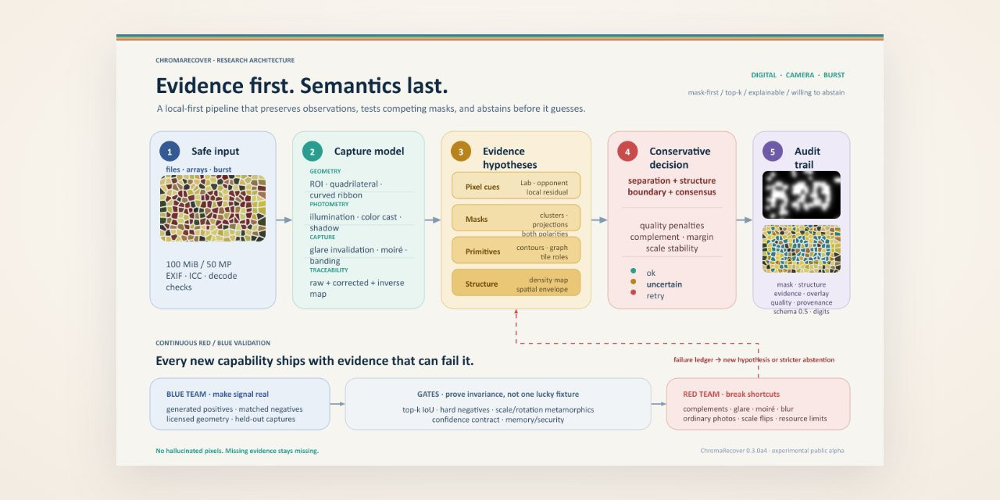
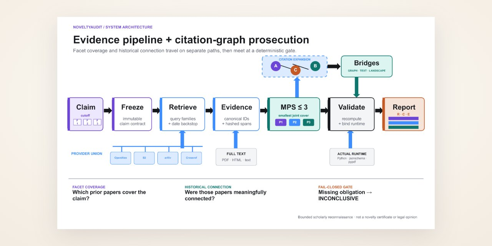
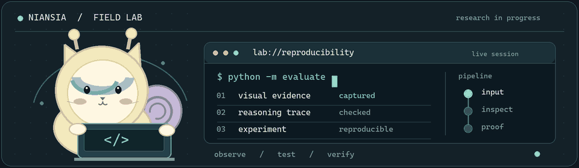
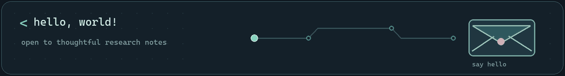

<picture>
  <source media="(prefers-color-scheme: dark)" srcset="assets/readme/cover-zh-CN-dark.jpg">
  
</picture>

[繁體中文](https://github.com/niansia/niansia/blob/main/README.zh-TW.md) · **简体中文** · [English](https://github.com/niansia/niansia/blob/main/README.md)

   

研究视觉与多模态 AI 的安全性、鲁棒性与推理能力， 并把研究问题做成证据可以被检查、也能被复现的工具。

## 关于我

我毕业于**元智大学（YZU）资讯工程学系**，目前是**阳明交通大学（NYCU）资讯工程硕士生**，现正休学一年。研究主要落在 **AI 安全、计算机视觉与视觉语言模型**的交汇处，特别关注可靠的多模态推理与模型评估。

我喜欢把研究问题和实际需求做成可复现的工具：每一个结论，都应该附上能检查它的证据。

## 最近在做

- ✍️ 准备投稿 **CVPR 2027**（VLM 相关）、**ICCV 2027**（DiT 相关）与 **COLM 2027**。
- 🚀 2026 年 9 月 28 日正式公开 **[Taiwan Exam](https://github.com/niansia/taiwan-exam)**：让 AI 出原创学测模拟考的 Agent Skill。
- 🌙 完成 **[LumiGrid](https://github.com/niansia/LumiGrid)**（NTIRE 2025 低光图像增强），比出发点的课堂做法高 8.1 dB。
- 🎓 阳明交大硕士班休学一年中。

## 研究兴趣

<table width="100%">
<tr>
<td width="50%" valign="top">

### 🛡️ AI 与多模态安全

- 多模态 AI 的安全性与鲁棒性
- 对抗攻击与失效模式分析
- 内容完整性与验证
- 可信赖、可审计的评估

</td>
<td width="50%" valign="top">

### 👁️ 视觉与多模态智能

- 计算机视觉与视觉语言模型
- 多模态推理与记忆
- 真实世界不确定性下的评估
- 可复现的失败案例分析

</td>
</tr>
</table>

## 精选项目

<table width="100%">
<tr>
<td width="50%" valign="top">

**[Taiwan Exam](https://github.com/niansia/taiwan-exam)** &nbsp;<code>Agent Skill</code> <code>学测七科</code>

让 AI 原创一份学测模拟考：不看答案重新解题验算、依官方答对率控制难度，再套用大考中心原始模板，交付题本与详解两份 PDF。
</td>
<td width="50%" valign="top">

**[LumiGrid](https://github.com/niansia/LumiGrid)** &nbsp;<code>计算机视觉</code> <code>NTIRE 2025</code>

以亮度引导的 Zero-DCE 曲线双边网格加上 NAFNet 细修的低光图像增强。在 20 组保留的 NTIRE 2025 测试图上达到 24.57 dB / SSIM 0.840，只用一张笔记本 GPU 训练。
</td>
</tr>
<tr>
<td width="50%" valign="top">

**[KCrashLab](https://github.com/niansia/KCrashLab)** &nbsp;<code>系统可靠性</code> <code>证据冻结</code>

以模拟为优先的 Windows 驱动程序可靠性研究平台：规范化案例、可续跑实验、精确失效签名，并生成可独立验证的证据包。
</td>
<td width="50%" valign="top">

**[Merriv](https://github.com/niansia/Merriv)** &nbsp;<code>模型发布</code> <code>Pre-alpha</code>

面向可部署 AI 模型的厂商中立发布证据层，把确切模型产物、配对评估、统计策略与来源信息绑定成可移植的 Model Change Report。
</td>
</tr>
<tr>
<td width="50%" valign="top">

**[ChromaRecover](https://github.com/niansia/ChromaRecover)** &nbsp;<code>计算机视觉</code> <code>Public alpha</code>

以本地运行为核心的计算机视觉工具，恢复由细微色彩差异承载的空间结构；比较多种假设、保留可审计产物，证据不足时选择不作判断。
</td>
<td width="50%" valign="top">

**[NoveltyAudit](https://github.com/niansia/NoveltyAudit)** &nbsp;<code>学术推理</code> <code>Alpha</code>

以证据为优先的学术新颖性对抗审查 Agent Skill：检索前冻结主张、找出 Minimal Prior Sets、应用历史时间截点，并记录搜索未能建立的部分。
</td>
</tr>
</table>

<a href="https://niansia.github.io/zh-cn/work/">全部作品与互动展示 →</a>

## 使用工具

## 联系与合作

> **想一起研究吗？**
>
> 如果你也对 **AI 安全、CV／VLM 推理、可信赖机器学习、实验复现或研究工具**感兴趣，欢迎来找我聊聊研究构想、数据集与模型失效案例喵
>
> 不论是一起读 paper、复现实验、设计 benchmark、分析不寻常的模型结果，还是把一个仍然模糊的想法慢慢做成可以运行、可以验证的 prototype，我都很乐意参与喵
>
> 如果你正在寻找研究伙伴、有跨领域问题想讨论，或刚好发现值得深入研究的 dataset、evaluation setting 或 failure case，也都可以发邮件给我喵
>
> 联系邮箱是 **[niansia930202@gmail.com](mailto:niansia930202@gmail.com)**，我可能无法每次都立刻回复，但看到后一定会认真阅读喵
>
> 也期待认识愿意一起把问题想深、把实验做扎实，并把研究过程整理得更可复现的人喵
>
> `(=^･ω･^=)`

