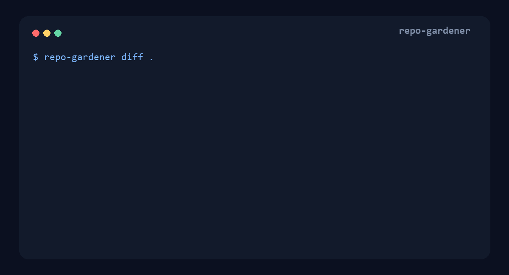

# 嗨，我是 Niansia 👋

**繁體中文** · [简体中文](https://github.com/niansia/niansia/blob/main/README.zh-CN.md) · [English](https://github.com/niansia/niansia/blob/main/README.md)

### 元智大學資訊工程學系應屆畢業生

**AI 安全 × 可信任評估 × 證據導向系統**

研究視覺與多模態智慧系統的安全性、穩健性與推理能力。

**目前正申請資訊工程相關研究所。**

[個人網站](https://niansia.github.io/zh-tw/) · [研究方向](https://niansia.github.io/zh-tw/#research) · [作品集](https://niansia.github.io/zh-tw/work/) · [Email](mailto:wilbur930202@gmail.com)

## 關於我

我今年剛從**元智大學（YZU）資訊工程學系**畢業，主要關注 **AI 安全、電腦視覺與視覺語言模型**的交叉領域，尤其是可靠的多模態推理與模型評估。

我把研究問題轉化成可重現的實驗與可運作的系統。目前的專案包括 [ContextSec](https://github.com/niansia/ContextSec)，一個面向 AI 程式代理的確定性產品安全決策層，以及 [Merriv](https://github.com/niansia/Merriv)，一個用於獨立驗證模型變更的發布證據層。

## 研究興趣

<table>
<tr>
<td width="50%" valign="top">

### 🛡️ AI 與多模態安全

- 多模態 AI 的安全性與穩健性
- 對抗攻擊與失效模式分析
- 內容完整性與驗證
- 可信任、可稽核的評估

</td>
<td width="50%" valign="top">

### 👁️ 視覺與多模態智慧

- 電腦視覺與視覺語言模型
- 多模態推理與記憶
- 真實世界不確定性下的評估
- 可重現的失敗案例分析

</td>
</tr>
</table>

## 精選專案

<table>
<tr>
<td width="50%" align="center" valign="top">
 
<strong><a href="https://github.com/niansia/ContextSec">ContextSec</a></strong> 
研究預覽階段、面向 AI 程式代理的確定性產品安全決策層。系統從有界的儲存庫證據推導實際適用的風險包、組合跨情境控制項，並輸出可驗證的 Control Evaluation Ledger 與明確的發布閘門。
</td>
<td width="50%" align="center" valign="top">
 
<strong><a href="https://github.com/niansia/Merriv">Merriv</a></strong> 
仍處 pre-alpha 階段、面向可部署 AI 模型的廠商中立發布證據層。系統將確切模型產物、配對評估、統計政策、來源資訊與回歸起點綁定為可攜式 Model Change Report，供模型升版前獨立驗證。
</td>
</tr>
<tr>
<td width="50%" align="center" valign="top">
 
<strong><a href="https://github.com/niansia/ai-repo-gardener">AI Repo Gardener</a></strong> 
Public alpha 階段、面向 AI 編輯 Python 儲存庫的靜態分析工具與可攜式 Agent Skill。系統結合匯入可達性、Git 時序與正規化 AST 證據，將薄弱判斷限制為僅供審查，並在刪除前要求綁定雜湊的計畫與隔離驗證。
</td>
<td width="50%" align="center" valign="top">
 
<strong><a href="https://github.com/niansia/ChromaRecover">ChromaRecover</a></strong> 
實驗性 public alpha、以本機運算為核心的 Python 電腦視覺工具，用於還原由細微色彩差異承載的空間結構。系統會比較多種色彩證據假設、保留可稽核產物，並在證據不足時選擇不作判定。
</td>
</tr>
</table>

## 使用工具

`Python` · `PyTorch` · `OpenCV` · `scikit-learn` · `Jupyter` · `C# / .NET` · `React` · `TypeScript` · `Node.js` · `SQLite` · `Git`

## 聯絡與合作

若您也關注 AI 安全、CV／VLM 推理、可信任機器學習、實驗重現或研究工具，歡迎來信交流研究構想、資料集、重現結果與模型失效案例。

聯絡信箱：**[wilbur930202@gmail.com](mailto:wilbur930202@gmail.com)**
