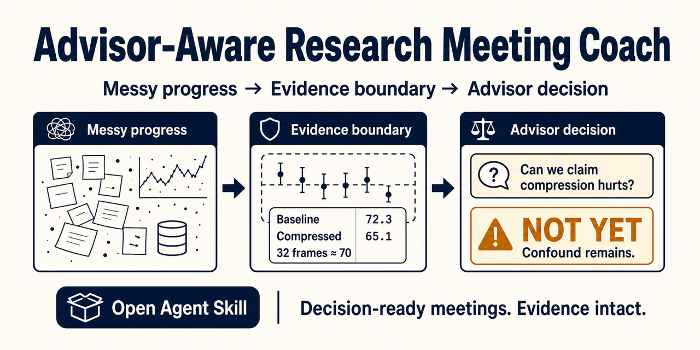

# 嗨，我是 niansia 👋

**繁體中文** · [简体中文](https://github.com/niansia/niansia/blob/main/README.zh-CN.md) · [English](https://github.com/niansia/niansia/blob/main/README.md)

### 元智大學資訊工程學系

**AI 安全 × 電腦視覺 × 視覺語言模型**

研究視覺與多模態智慧系統的安全性、穩健性與推理能力。

**目前正申請資訊工程相關研究所。**

[個人網站](https://niansia.github.io/zh-tw/) · [研究方向](https://niansia.github.io/zh-tw/#research) · [精選作品](https://niansia.github.io/zh-tw/#work) · [Email](mailto:wilbur930202@gmail.com)

## 關於我

我今年剛從**元智大學（YZU）資訊工程學系**畢業，主要關注 **AI 安全、電腦視覺與視覺語言模型**的交叉領域，尤其是可靠的多模態推理與模型評估。

我喜歡把研究問題轉化成可重現的實驗與可運作的系統，從證據導向的研究工具、模型評估流程，到互動式軟體。目前部分研究仍在開發或審查階段，因此維持非公開；程式碼、結果與可重現成果將在合適時機釋出。

## 研究興趣

<table>
<tr>
<td width="50%" valign="top">

### 🛡️ AI 與多模態安全

- 多模態 AI 的安全性與穩健性
- 對抗攻擊與失效模式分析
- 內容完整性與驗證
- 可信任、可稽核的評估

</td>
<td width="50%" valign="top">

### 👁️ 視覺與多模態智慧

- 電腦視覺與視覺語言模型
- 多模態推理與記憶
- 真實世界不確定性下的評估
- 可重現的失敗案例分析

</td>
</tr>
</table>

## 精選專案

<table>
<tr>
<td width="50%" align="center" valign="top">
 
<strong><a href="https://github.com/niansia/Merriv">Merriv</a></strong> 
仍處 pre-alpha 階段、面向可部署 AI 模型的廠商中立發布證據層。系統將確切模型產物、配對評估、統計政策、來源資訊與回歸起點綁定為可攜式 Model Change Report，供模型升版前獨立驗證。
</td>
<td width="50%" align="center" valign="top">
 
<strong><a href="https://github.com/niansia/ChromaRecover">ChromaRecover</a></strong> 
實驗性 public alpha、以本機運算為核心的 Python 電腦視覺工具，用於還原由細微色彩差異承載的空間結構。系統會比較多種色彩證據假設、保留可稽核產物，並在證據不足時選擇不作判定。
</td>
</tr>
<tr>
<td width="50%" align="center" valign="top">
 
<strong><a href="https://github.com/niansia/NoveltyAudit">NoveltyAudit</a></strong> 
用於對抗式學術新穎性稽核的證據導向工具，包含研究主張拆解、歷史時間截點與 bridge-aware 先前工作分析。
</td>
<td width="50%" align="center" valign="top">
 
<strong><a href="https://github.com/niansia/research-meeting-coach">研究會議教練</a></strong> 
尚處 early alpha 階段、以證據為核心的 Agent Skill，可將零散研究進度整理成可供指導教授決策的會議內容，並限制研究主張不超出既有證據。
</td>
</tr>
</table>

## 延伸興趣

`量化機器學習` · `系統` · `互動運算` · `研究軟體`

## 使用工具

`Python` · `PyTorch` · `OpenCV` · `scikit-learn` · `Jupyter` · `C# / .NET` · `React` · `TypeScript` · `Node.js` · `SQLite` · `Git`

## 聯絡與合作

若您也關注 AI 安全、CV／VLM 推理、可信任機器學習、實驗重現或研究工具，歡迎來信交流研究構想、資料集、重現結果與模型失效案例。

聯絡信箱：**[wilbur930202@gmail.com](mailto:wilbur930202@gmail.com)**
