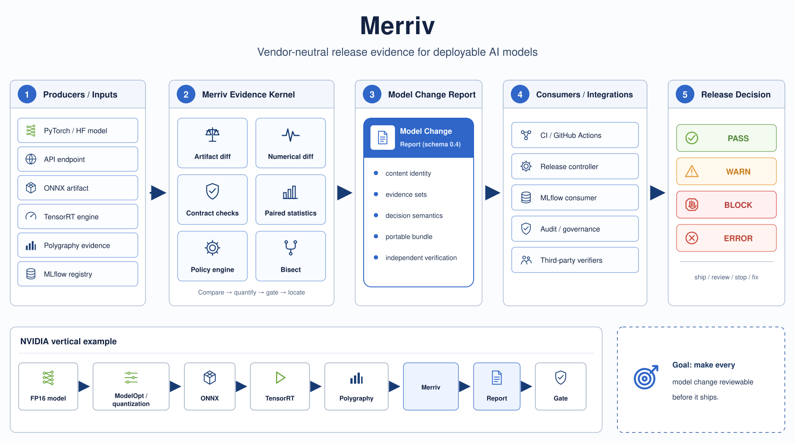

# 嗨，我是 Niansia 👋

**繁體中文** · [简体中文](https://github.com/niansia/niansia/blob/main/README.zh-CN.md) · [English](https://github.com/niansia/niansia/blob/main/README.md)

### 國立陽明交通大學碩士生 · 目前休學一年

**AI 安全 × 可信任評估 × 證據導向系統**

研究視覺與多模態智慧系統的安全性、穩健性與推理能力。

**目前為陽明交通大學碩士生，現正休學一年。**

[個人網站](https://niansia.github.io/zh-tw/) · [研究方向](https://niansia.github.io/zh-tw/#research) · [作品集](https://niansia.github.io/zh-tw/work/) · [Email](mailto:niansia930202@gmail.com)

## 關於我

我畢業於**元智大學（YZU）資訊工程學系**，目前就讀**國立陽明交通大學（NYCU）碩士班**，現正休學一年。我的研究主要關注 **AI 安全、電腦視覺與視覺語言模型**的交叉領域，尤其是可靠的多模態推理與模型評估。

我把研究問題與實際需求轉化成可重現的工具。目前的專案包括 [KCrashLab](https://github.com/niansia/KCrashLab)，一個用於 Windows 驅動程式可靠性研究的確定性平台，以及 [Taiwan Exam](https://github.com/niansia/taiwan-exam)，一個用於產生並檢查原創學測模擬考的 Agent Skill。

## 研究興趣

<table>
<tr>
<td width="50%" valign="top">

### 🛡️ AI 與多模態安全

- 多模態 AI 的安全性與穩健性
- 對抗攻擊與失效模式分析
- 內容完整性與驗證
- 可信任、可稽核的評估

</td>
<td width="50%" valign="top">

### 👁️ 視覺與多模態智慧

- 電腦視覺與視覺語言模型
- 多模態推理與記憶
- 真實世界不確定性下的評估
- 可重現的失敗案例分析

</td>
</tr>
</table>

## 精選專案

<table>
<tr>
<td width="50%" align="center" valign="top">
 
<strong><a href="https://github.com/niansia/taiwan-exam">Taiwan Exam</a></strong> 
用於產生原創學測模擬考的 Agent Skill，目前支援七科。流程包含命題、答案與難度檢查、套用大考正式版面，並分開交付題目 PDF 與答案詳解 PDF；會考與分科測驗仍在製作中。
</td>
<td width="50%" align="center" valign="top">
 
<strong><a href="https://github.com/niansia/Merriv">Merriv</a></strong> 
仍處 pre-alpha 階段、面向可部署 AI 模型的廠商中立發布證據層。系統將確切模型產物、配對評估、統計政策、來源資訊與回歸起點綁定為可攜式 Model Change Report，供模型升版前獨立驗證。
</td>
</tr>
<tr>
<td width="50%" align="center" valign="top">
 
<strong><a href="https://github.com/niansia/KCrashLab">KCrashLab</a></strong> 
已完成證據凍結的 Windows 驅動程式可靠性研究平台，涵蓋標準化案例、可續跑實驗、精確失效簽章、觸發條件最小化、3/3 模擬重播與語意證據驗證，並明確區分模擬證據與受控的 Windows lab 路徑。
</td>
<td width="50%" align="center" valign="top">
 
<strong><a href="https://github.com/niansia/ChromaRecover">ChromaRecover</a></strong> 
實驗性 public alpha、以本機運算為核心的 Python 電腦視覺工具，用於還原由細微色彩差異承載的空間結構。系統會比較多種色彩證據假設、保留可稽核產物，並在證據不足時選擇不作判定。
</td>
</tr>
</table>

## 使用工具

`Python` · `PyTorch` · `OpenCV` · `scikit-learn` · `Jupyter` · `C# / .NET` · `React` · `TypeScript` · `Node.js` · `SQLite` · `Git`

## 聯絡與合作

> **想一起研究嗎？**
>
> 如果你也對 **AI 安全、CV／VLM 推理、可信任機器學習、實驗重現或研究工具**有興趣，歡迎來找我聊聊研究構想、資料集與模型失效案例喵
>
> 不論是一起讀 paper、重現實驗、設計 benchmark、分析不尋常的模型結果，或把一個還很模糊的想法慢慢做成可運作、可驗證的 prototype，我都很樂意參與喵
>
> 如果你正在尋找研究夥伴、有跨領域題目想討論，或剛好發現值得深入研究的 dataset、evaluation setting 或 failure case，也都可以寄信給我喵
>
> 聯絡信箱是 **[niansia930202@gmail.com](mailto:niansia930202@gmail.com)**，我可能無法每次都立刻回覆，但有看到就會認真閱讀喵
>
> 也期待遇見願意一起把問題想深、把實驗做紮實，並把研究過程整理得更可重現的人喵
>
> `(=^･ω･^=)`

