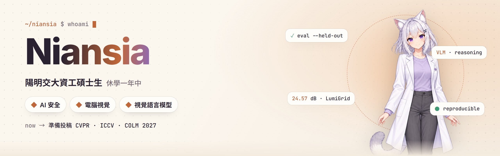
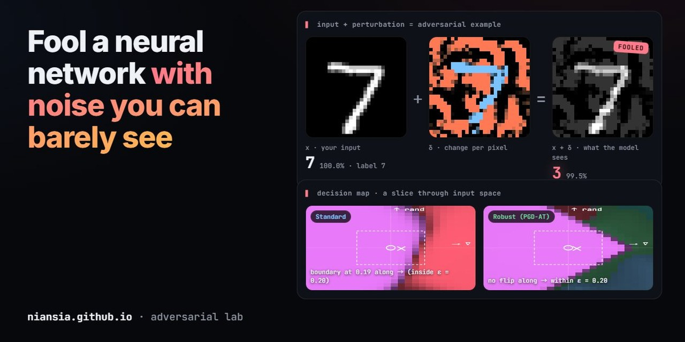

<picture>
  <source media="(prefers-color-scheme: dark)" srcset="assets/readme/cover-zh-TW-dark.jpg">
  
</picture>

**繁體中文** · [简体中文](https://github.com/niansia/niansia/blob/main/README.zh-CN.md) · [English](https://github.com/niansia/niansia/blob/main/README.md)

   

研究視覺與多模態 AI 的安全性、穩健性與推理能力， 並把研究問題做成證據可以被檢查、也能被重現的工具。

## 關於我

我畢業於**元智大學（YZU）資訊工程學系**，目前是**國立陽明交通大學（NYCU）資訊工程碩士生**，現正休學一年。研究主要落在 **AI 安全、電腦視覺與視覺語言模型**的交會處，特別關注可靠的多模態推理與模型評估。

我喜歡把研究問題和實際需求做成可重現的工具：每一個結論，都應該附上能檢查它的證據。

## 最近在做

- ✍️ 準備投稿 **CVPR 2027**（VLM 相關）、**ICCV 2027**（DiT 相關）與 **COLM 2027**。
- 🚀 2026 年 9 月 28 日正式公開 **[Taiwan Exam](https://github.com/niansia/taiwan-exam)**：讓 AI 出原創學測模擬考的 Agent Skill。
- 🌙 完成 **[LumiGrid](https://github.com/niansia/LumiGrid)**（NTIRE 2025 低光影像增強），比出發點的課堂作法高 8.1 dB。
- 🎓 陽明交大碩士班休學一年中。

## 研究興趣

<table width="100%">
<tr>
<td width="50%" valign="top">

### 🛡️ AI 與多模態安全

- 多模態 AI 的安全性與穩健性
- 對抗攻擊與失效模式分析
- 內容完整性與驗證
- 可信任、可稽核的評估

</td>
<td width="50%" valign="top">

### 👁️ 視覺與多模態智慧

- 電腦視覺與視覺語言模型
- 多模態推理與記憶
- 真實世界不確定性下的評估
- 可重現的失敗案例分析

</td>
</tr>
</table>

## 精選專案

<table width="100%">
<tr>
<td width="50%" valign="top">

**[Taiwan Exam](https://github.com/niansia/taiwan-exam)** &nbsp;<code>Agent Skill</code> <code>學測七科</code>

讓 AI 原創一份學測模擬考：不看答案重新解題驗算、依官方答對率控制難度，再套用大考中心原始模板，交付題本與詳解兩份 PDF。
</td>
<td width="50%" valign="top">

**[LumiGrid](https://github.com/niansia/LumiGrid)** &nbsp;<code>電腦視覺</code> <code>NTIRE 2025</code>

以亮度引導的 Zero-DCE 曲線雙邊網格加上 NAFNet 細修的低光影像增強。在 20 組保留的 NTIRE 2025 測試圖上達 24.57 dB / SSIM 0.840，只用一張筆電 GPU 訓練。
</td>
</tr>
<tr>
<td width="50%" valign="top">

**[KCrashLab](https://github.com/niansia/KCrashLab)** &nbsp;<code>系統可靠性</code> <code>證據凍結</code>

以模擬為優先的 Windows 驅動程式可靠性研究平台：標準化案例、可續跑實驗、精確失效簽章，並產生可獨立驗證的證據包。
</td>
<td width="50%" valign="top">

**[Adversarial Lab](https://github.com/niansia/adversarial-lab)** &nbsp;<code>AI 安全</code> <code>線上試玩</code>

在瀏覽器裡用你的 CPU 對數字分類器發動 FGSM 與 PGD 攻擊：一般模型在 ε = 0.3 時準確率掉到 0%，對抗訓練模型仍守住 85%；附決策地圖與梯度遮蔽檢查。
</td>
</tr>
<tr>
<td width="50%" valign="top">

**[ChromaRecover](https://github.com/niansia/ChromaRecover)** &nbsp;<code>電腦視覺</code> <code>Public alpha</code>

以本機運算為核心的電腦視覺工具，還原由細微色彩差異承載的空間結構；比較多種假設、保留可稽核產物，證據不足時選擇不作判定。
</td>
<td width="50%" valign="top">

**[NoveltyAudit](https://github.com/niansia/NoveltyAudit)** &nbsp;<code>學術推理</code> <code>Alpha</code>

以證據為優先的學術新穎性對抗審查 Agent Skill：檢索前凍結主張、找出 Minimal Prior Sets、套用歷史時間截點，並記錄搜尋未能建立的部分。
</td>
</tr>
</table>

<a href="https://niansia.com/zh-tw/work/">全部作品與互動展示 →</a>

## 使用工具

<picture>
  <source media="(prefers-color-scheme: dark)" srcset="https://raw.githubusercontent.com/niansia/niansia/output/yuki-eats-contributions-dark.svg">
  
</picture>

## 聯絡與合作

> **想一起研究嗎？**
>
> 如果你也對 **AI 安全、CV／VLM 推理、可信任機器學習、實驗重現或研究工具**有興趣，歡迎來找我聊聊研究構想、資料集與模型失效案例喵
>
> 不論是一起讀 paper、重現實驗、設計 benchmark、分析不尋常的模型結果，或把一個還很模糊的想法慢慢做成可運作、可驗證的 prototype，我都很樂意參與喵
>
> 如果你正在尋找研究夥伴、有跨領域題目想討論，或剛好發現值得深入研究的 dataset、evaluation setting 或 failure case，也都可以寄信給我喵
>
> 聯絡信箱是 **[niansia930202@gmail.com](mailto:niansia930202@gmail.com)**，我可能無法每次都立刻回覆，但有看到就會認真閱讀喵
>
> 也期待遇見願意一起把問題想深、把實驗做紮實，並把研究過程整理得更可重現的人喵
>
> `(=^･ω･^=)`

<picture>
  <source media="(prefers-color-scheme: dark)" srcset="assets/readme/contact-terminal-dark.svg">
  
</picture>

