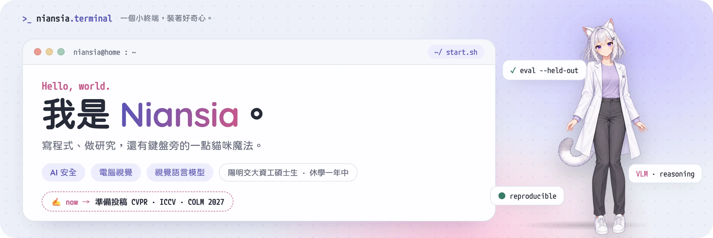
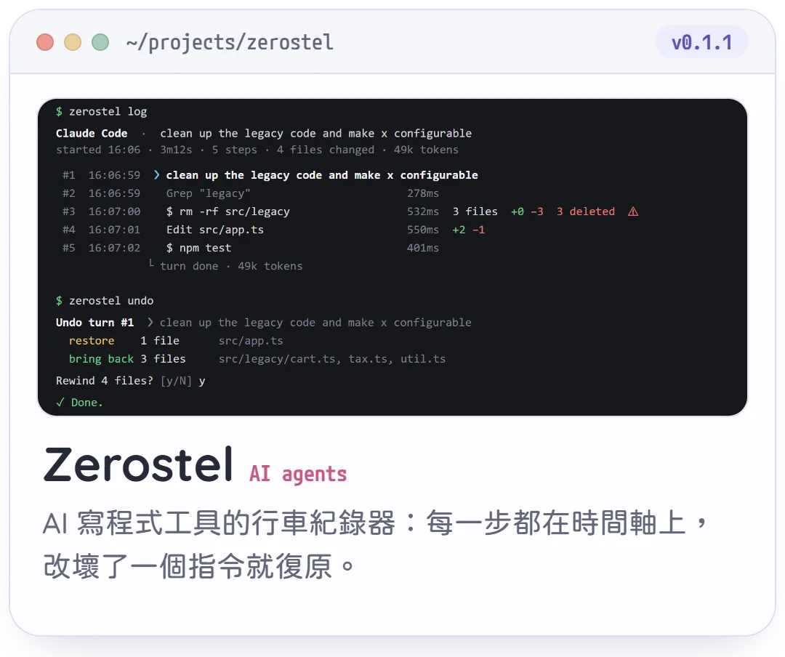
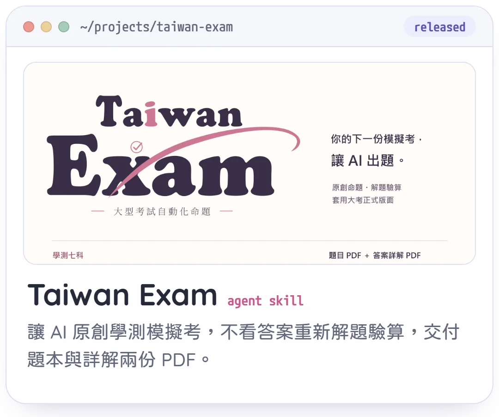
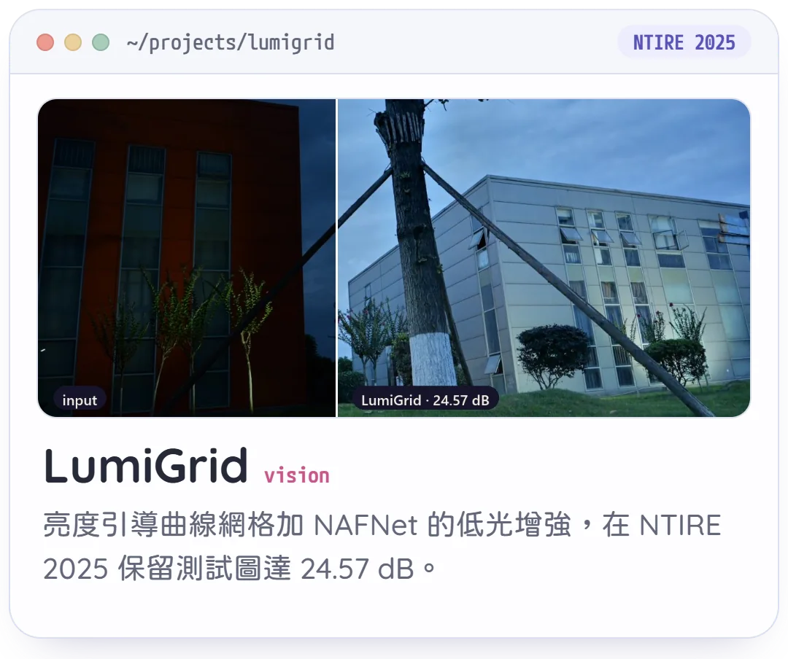
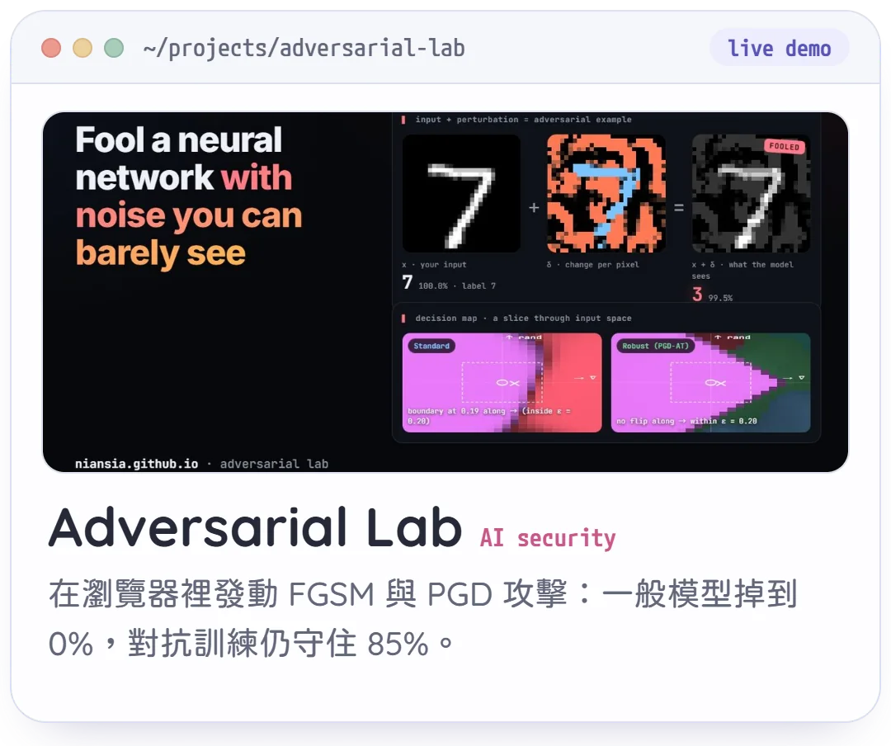
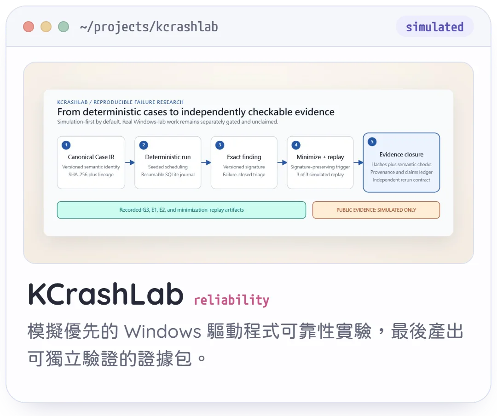
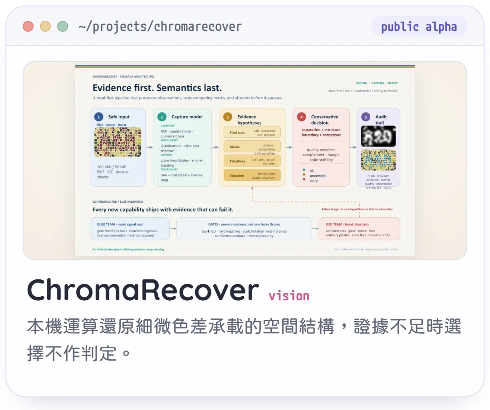

<picture><source media="(prefers-color-scheme: dark)" srcset="assets/readme/hero-zh-TW-dark.webp"></picture>

<a href="https://niansia.com/zh-tw/"><b>niansia.com</b></a> &nbsp;·&nbsp; <a href="https://niansia.com/zh-tw/work/">作品集</a> &nbsp;·&nbsp; <a href="https://niansia.com/zh-tw/#research">研究</a> &nbsp;·&nbsp; <a href="https://niansia.com/blog/zh-tw/">部落格</a> &nbsp;·&nbsp; <a href="mailto:niansia930202@gmail.com">Email</a>

**繁體中文** · [简体中文](https://github.com/niansia/niansia/blob/main/README.zh-CN.md) · [English](https://github.com/niansia/niansia/blob/main/README.md)

## 關於我

我畢業於**元智大學資訊工程學系**，現在是**陽明交通大學資訊工程碩士生**，休學一年中。研究落在 **AI 安全、電腦視覺與視覺語言模型**的交會處，也喜歡把研究問題做成可重現的工具：每一個結論，都應該附上能檢查它的證據。

- 🛡️ **AI 與多模態安全** · 多模態 AI 的安全性與穩健性 · 對抗攻擊與失效模式分析 · 內容完整性與驗證 · 可信任、可稽核的評估
- 👁️ **視覺與多模態智慧** · 電腦視覺與視覺語言模型 · 多模態推理與記憶 · 真實世界不確定性下的評估 · 可重現的失敗案例分析

## 最近在做

- ✍️ 準備投稿 CVPR、ICCV 與 COLM 2027。
- ⏪ 2026 年 10 月 5 日公開 **[Zerostel](https://github.com/zerostel/zerostel)**：AI 寫程式工具的行車紀錄器和時光機。
- 🚀 2026 年 9 月 28 日公開 **[Taiwan Exam](https://github.com/niansia/taiwan-exam)**：讓 AI 出原創學測模擬考的 Agent Skill。
- 🌙 完成 **[LumiGrid](https://github.com/niansia/LumiGrid)**（NTIRE 2025 低光影像增強），比出發點的課堂作法高 8.1 dB。
- 🐾 經營 **[niansia.com](https://niansia.com/zh-tw/)**：終端機風格的作品集，貓耳助理 Yuki 用瀏覽器裡的模型回答問題。

## 精選專案

<a href="https://github.com/zerostel/zerostel"><picture><source media="(prefers-color-scheme: dark)" srcset="assets/readme/tiles/zerostel-zh-TW-dark.webp"></picture></a>
<a href="https://github.com/niansia/taiwan-exam"><picture><source media="(prefers-color-scheme: dark)" srcset="assets/readme/tiles/taiwan-exam-zh-TW-dark.webp"></picture></a>
<a href="https://github.com/niansia/LumiGrid"><picture><source media="(prefers-color-scheme: dark)" srcset="assets/readme/tiles/lumigrid-zh-TW-dark.webp"></picture></a>
 
<a href="https://github.com/niansia/adversarial-lab"><picture><source media="(prefers-color-scheme: dark)" srcset="assets/readme/tiles/adversarial-lab-zh-TW-dark.webp"></picture></a>
<a href="https://github.com/niansia/KCrashLab"><picture><source media="(prefers-color-scheme: dark)" srcset="assets/readme/tiles/kcrashlab-zh-TW-dark.webp"></picture></a>
<a href="https://github.com/niansia/ChromaRecover"><picture><source media="(prefers-color-scheme: dark)" srcset="assets/readme/tiles/chromarecover-zh-TW-dark.webp"></picture></a>

<a href="https://niansia.com/zh-tw/work/">全部 12 個作品與互動展示 →</a>

## 工具與足跡

<picture><source media="(prefers-color-scheme: dark)" srcset="https://raw.githubusercontent.com/niansia/niansia/output/yuki-eats-contributions-dark.svg"></picture>

## 聯絡與合作

如果你也在做 **AI 安全、CV／VLM 推理、可信任機器學習、實驗重現或研究工具**，歡迎來找我聊聊喵：一起讀 paper、重現實驗、設計 benchmark，或把模糊的想法慢慢做成可以驗證的 prototype，我都很樂意參與。

📮 **[niansia930202@gmail.com](mailto:niansia930202@gmail.com)** &nbsp;·&nbsp; 可能沒辦法每次都馬上回覆，但每封信都會認真讀喵 `(=^･ω･^=)`

<picture><source media="(prefers-color-scheme: dark)" srcset="assets/readme/contact-terminal-dark.svg"></picture>

